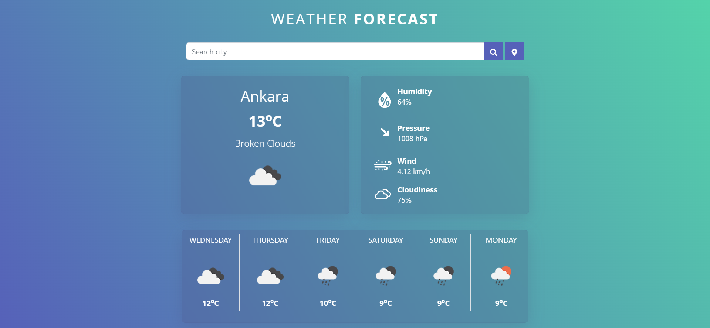
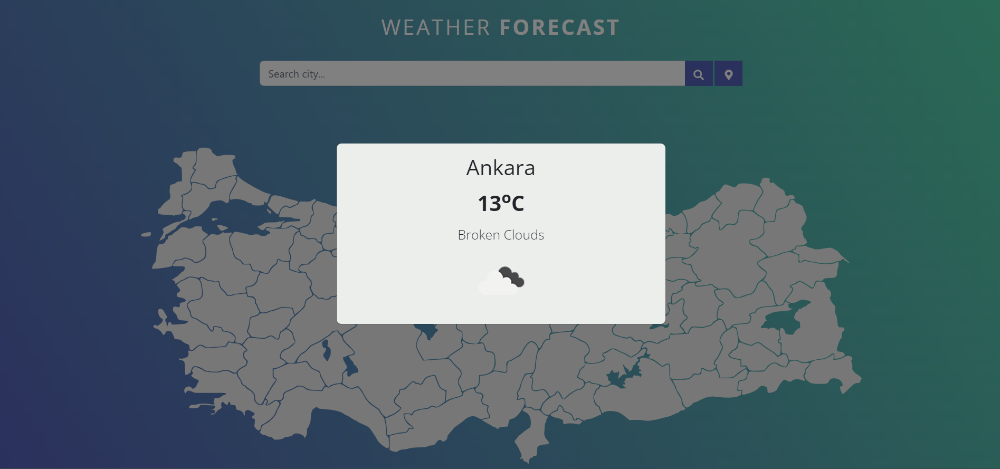

## About
Weather App is a simple, little, responsive web application saying what the weather will be like the next day or for the next few days. 
It also allows you to see the weather information of the city you selected on the map of Turkey.

### See Live : [Here](https://effulgent-pudding-24a5fc.netlify.app/)

The app utilizes:

- OpenWeatherMap’s API,
- OpenWeatherMap’s icons for weather icons,
- create-react-app tool,
- Fetch API for easy http requests,
- Bootstrap and React Bootstrap for styling and design.
- Context API for state management
- turkey-map-react for city map of Turkey

## Screenshots

